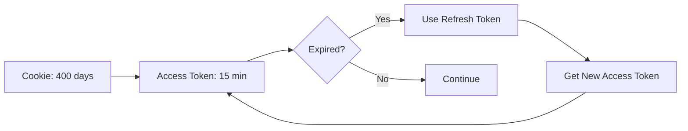

AuthKit Next.js uses HTTP-only cookies to store encrypted session data. This guide covers advanced cookie configuration and security considerations.

## Cookie architecture

AuthKit uses two types of cookies:

### Session cookie (persistent)

The main session cookie stores encrypted session data including access and refresh tokens.

- **Name:** `wos-session` (default, configurable via `WORKOS_COOKIE_NAME`)
- **Duration:** 400 days (default, configurable via `WORKOS_COOKIE_MAX_AGE`)
- **Security:** HttpOnly, Secure (on HTTPS), encrypted with `WORKOS_COOKIE_PASSWORD`
- **Size:** ~2-4 KB depending on user data

### Access token cookie (ephemeral)

When using [eager auth](/advanced/eager-auth), a temporary cookie provides synchronous token access.

- **Name:** `workos-access-token`
- **Duration:** 30 seconds
- **Purpose:** Enable immediate client-side token access on page load
- **Auto-consumed:** Deleted after first read

## Cookie security attributes

### HttpOnly

**Status:** Always enabled

Prevents JavaScript access to the cookie, protecting against XSS attacks.

```typescript
// From cookie.ts:84
return {
  path: '/',
  httpOnly: true,  // Always true
  secure,
  sameSite,
  maxAge,
  domain: WORKOS_COOKIE_DOMAIN || '',
};
```

### Secure

**Status:** Automatically set based on protocol

Ensures cookies are only sent over HTTPS connections.

```typescript
// From cookie.ts:44-57
let secure: boolean;
if (sameSite.toLowerCase() === 'none') {
  secure = true;  // Required for SameSite=None
} else if (urlString) {
  const url = new URL(urlString);
  secure = url.protocol === 'https:';
} else {
  secure = true;  // Production default
}
```

<Note>
  In local development with `http://localhost`, the Secure flag is automatically disabled to allow cookie storage.
</Note>

### SameSite

Controls when cookies are sent with cross-site requests.

<Tabs>
  <Tab title="lax (default)">
    **Recommended for most applications**
    
    Cookies are sent with:
    - Same-site requests
    - Top-level navigation (e.g., clicking a link)
    
    Not sent with:
    - Cross-site POST requests
    - Embedded iframes
    
    ```sh
    WORKOS_COOKIE_SAMESITE='lax'
    ```
  </Tab>
  
  <Tab title="strict">
    **Maximum security**
    
    Cookies are only sent with same-site requests. Provides the strongest CSRF protection but may affect user experience if your app is accessed from external links.
    
    ```sh
    WORKOS_COOKIE_SAMESITE='strict'
    ```
    
    <Warning>
      Users clicking links from external sites (email, Slack, etc.) will appear logged out initially.
    </Warning>
  </Tab>
  
  <Tab title="none">
    **Cross-origin contexts**
    
    Cookies are sent with all requests, including cross-site. Required for embedded applications (iframes) but reduces CSRF protection.
    
    ```sh
    WORKOS_COOKIE_SAMESITE='none'
    ```
    
    <Warning>
      - Requires `Secure` flag (HTTPS only)
      - Reduces protection against CSRF attacks
      - Only use when absolutely necessary (e.g., embedded widget)
    </Warning>
  </Tab>
</Tabs>

## Cookie lifespan

### Maximum age

Configure how long the cookie remains valid:

```sh
# Default: 400 days (Chrome's maximum)
WORKOS_COOKIE_MAX_AGE='34560000'

# 1 day
WORKOS_COOKIE_MAX_AGE='86400'

# 1 hour (short-lived sessions)
WORKOS_COOKIE_MAX_AGE='3600'
```

<Info>
  The cookie expiry is separate from token expiry. The access token typically expires after 15 minutes, but the cookie persists to enable automatic token refresh.
</Info>

### Token refresh cycle



The long cookie duration enables seamless token refresh without requiring users to re-authenticate.

## Domain configuration

### Single domain (default)

Cookies are scoped to the current domain only:

```sh
# No configuration needed
# Cookie valid for: app.example.com only
```

### Shared domains

Share sessions across multiple subdomains:

```sh
WORKOS_COOKIE_DOMAIN='example.com'
```

This makes cookies valid for:
- `example.com`
- `app.example.com`
- `dashboard.example.com`
- Any other subdomain

<Tip>
  All applications sharing the cookie domain must use the same `WORKOS_COOKIE_PASSWORD` to decrypt the session.
</Tip>

### Multi-application sessions

Example setup for shared authentication across multiple apps:

<Steps>
  <Step title="Configure shared domain">
    Set the same cookie domain in all applications:
    
    ```sh
    # App 1 (app.example.com)
    WORKOS_COOKIE_DOMAIN='example.com'
    WORKOS_COOKIE_PASSWORD='shared-secret-min-32-chars'
    
    # App 2 (dashboard.example.com)
    WORKOS_COOKIE_DOMAIN='example.com'
    WORKOS_COOKIE_PASSWORD='shared-secret-min-32-chars'  # Must match!
    ```
  </Step>
  
  <Step title="Configure redirect URIs">
    Each app needs its own callback URL in WorkOS dashboard:
    
    - `https://app.example.com/callback`
    - `https://dashboard.example.com/callback`
  </Step>
  
  <Step title="Sign in from any app">
    Users authenticate once and the session is available across all configured domains.
  </Step>
</Steps>

## Custom cookie names

Customize the cookie name to avoid conflicts:

```sh
WORKOS_COOKIE_NAME='my-app-session'
```

Useful when:
- Running multiple AuthKit instances on the same domain
- Migrating from another authentication system
- Testing different configurations simultaneously

## Cookie size optimization

Session cookies contain:
- Access token (~1.5 KB)
- Refresh token (~200 bytes)
- User object (~1-2 KB depending on fields)
- Impersonator data (if present)

Total size is typically 2-4 KB, well within browser limits (4 KB per cookie).

<Warning>
  Cookies larger than 4 KB will be rejected by browsers. Avoid storing additional data in the session cookie.
</Warning>

## Security best practices

<AccordionGroup>
  <Accordion title="Use HTTPS in production">
    Always deploy with HTTPS to ensure cookies have the Secure flag and cannot be intercepted.
  </Accordion>

  <Accordion title="Set appropriate SameSite">
    Use `lax` or `strict` unless you specifically need cross-origin cookie access.
  </Accordion>

  <Accordion title="Limit cookie domain scope">
    Only set `WORKOS_COOKIE_DOMAIN` if you need cross-subdomain sessions. Narrower scope reduces attack surface.
  </Accordion>

  <Accordion title="Rotate cookie passwords">
    Periodically update `WORKOS_COOKIE_PASSWORD`. Existing sessions will be invalidated, requiring users to sign in again.
  </Accordion>

  <Accordion title="Monitor cookie size">
    If storing custom claims or extending the user object, monitor cookie size to stay under 4 KB.
  </Accordion>
</AccordionGroup>

## Troubleshooting

<Accordion title="Cookies not being set">
  **Possible causes:**
  - Protocol mismatch (trying to set Secure cookies on HTTP)
  - Domain mismatch (cookie domain doesn't match current domain)
  - Cookie size exceeds 4 KB
  
  **Solution:** Check browser developer tools > Application > Cookies to see rejection reasons.
</Accordion>

<Accordion title="Sessions not shared across subdomains">
  **Issue:** User authenticated on `app.example.com` but not on `dashboard.example.com`
  
  **Solution:** 
  1. Set `WORKOS_COOKIE_DOMAIN='example.com'` in both apps
  2. Use the same `WORKOS_COOKIE_PASSWORD` in both apps
  3. Clear existing cookies and re-authenticate
</Accordion>

<Accordion title="SameSite=None cookies blocked">
  **Issue:** Cookies rejected in embedded contexts (iframes)
  
  **Solution:**
  1. Ensure you're using HTTPS (required for SameSite=None)
  2. Set `WORKOS_COOKIE_SAMESITE='none'`
  3. Verify the Secure flag is present in browser dev tools
</Accordion>

## Related resources

<CardGroup cols={2}>
  <Card title="Environment variables" icon="gear" href="/configuration/environment-variables">
    Complete configuration reference
  </Card>
  <Card title="CDN deployments" icon="server" href="/guides/cdn-deployments">
    Cache control and CDN considerations
  </Card>
</CardGroup>
